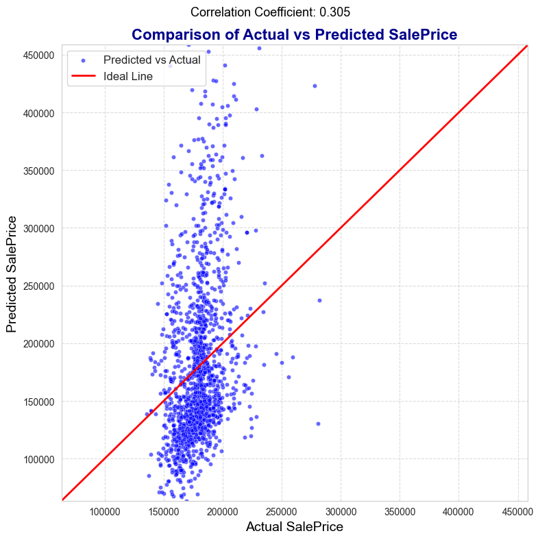

## House Prices - Tensorflow Random Forest
### Project #2

This project is part of the "100 Days to Get Hired" challenge. 

For my first project, I chose the well-known House Prices challenge on Kaggle. The tool used for the prediction will be autoGluon. 

**Project Goals** 

* Explore and understand the dataset provided.
* Apply feature engineering techniques to improve model performance.
* Utilize autoGluon to build and optimize a regression model.
* Submit predictions to Kaggle and evaluate the results.

**Dataset**

The dataset can be found [here](https://www.kaggle.com/competitions/house-prices-advanced-regression-techniques)

**Tools and Technologies**

* Python
* Pandas
* NumPy
* Scikit-learn
* autoGluon

### Conclusion

AutoGluon is an AutoML tool that internally includes data preprocessing, model training, and the comparison of various models, including LightGBM, CatBoost, XGBoost, Random Forest, ExtraTrees, Neural Networks, K-Nearest Neighbors, Linear Models, and Weighted Ensembling. After training on all relevant models, AutoGluon compares the results and selects the model that offers the best performance.

However, the results were not acceptable. The graph below suggests a discrepancy between the actual and predicted values. Moreover, the correlation between the two variables was calculated to be 0.29, indicating a significant distance between them.

### Next Steps

The next step is to manually preprocess the data and use AutoGluon only for model training. This approach will allow for more control over the data preparation process, which could improve the model's performance by addressing specific issues within the dataset that may not have been adequately handled by the automatic preprocessing.
